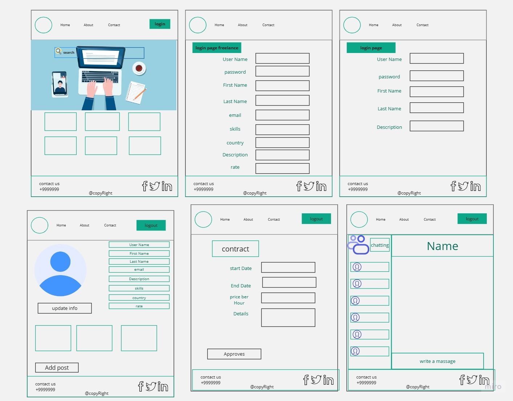
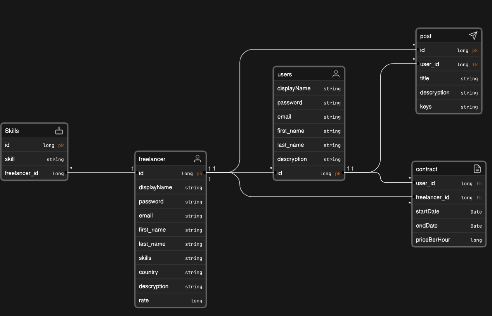

## wireFrames

**Homepage Wireframe:**
The homepage wireframe serves as the digital gateway to your platform, presenting a visually appealing and informative interface. The layout is designed to capture users' attention, showcasing the platform's unique value proposition. It may include elements like a hero section with a catchy tagline, featured services, testimonials, and clear call-to-action buttons leading to the login or sign-up pages. The color scheme and design elements aim to reflect the brand's identity, fostering a welcoming and engaging user experience.

**Login Page Wireframe:**
The login page wireframe is a pivotal entry point for registered users. It offers a clean and straightforward design, allowing users to input their credentials—username or email and password. It may also have options for social login, enhancing user convenience. Error handling and password recovery functionalities are also incorporated to assist users in case of any login-related issues.

**Sign-up Page Wireframe:**
The sign-up page wireframe is designed to encourage new users, whether they are regular users or freelancers, to join the platform. It presents a form where users can input their essential details, such as name, email, password, and type of account (user or freelancer). The wireframe ensures a seamless registration process with clear instructions, optional account setup steps, and validation checks to ensure data accuracy.

**Contract Page Wireframe:**
The contract page wireframe is a critical component for users and freelancers to initiate and manage their contracts or projects. It provides a structured layout to outline project details, timelines, milestones, and terms and conditions. Interactive elements may include buttons to accept or negotiate terms, initiate payments, and communicate with other parties involved in the contract. The wireframe focuses on clarity and ease of use, making it simple for users to comprehend and act upon contract-related information.

**Profile Page Wireframe:**
The profile page wireframe allows users and freelancers to showcase their skills, experiences, and portfolio. It typically features sections for personal information, work history, skills, projects, and contact details. The wireframe emphasizes a visually appealing and organized layout, enabling users to update and customize their profiles easily. Interactive features may include options to edit, upload images or documents, and connect with other users or potential clients.

## User Story

1. As a user i want to make a signup and login with the same credits so that i can access the website
2. As a user i want to make a contract and this contract must be visible to freelancers
3. As a freelancer i want to accept and make offers into users contracts
4. As a user i want to edit my profile so that i can update my information
5. As a user i want to chat with the freelancer so that i can get more in touch

## Software Requirments
1. java 11
2. spring boot
3. postgresSql

## DataBase Schema

1. users table: This table stores information about the users of the app, such as their ID, first name, last name, email address, and password.
2. freelancers table: This table stores information about the freelancers who use the app, such as their ID, first name, last name, email address, password, country, and a description of their skills.
3. contracts table: This table stores information about the contracts between users and freelancers, such as the contract ID, freelancer ID, user ID, start date, end date, price per hour, and a description of the work to be done.
4. posts table: This table stores information about the posts that users create on the app, such as the post ID, user ID, language, title, description, and keywords.

The tables are related to each other in the following ways:

1. A user can have many contracts, but a contract can only have one user. This is a one-to-many relationship.

2. A freelancer can have many contracts, but a contract can only have one freelancer. This is also a one-to-many relationship.

3. A freelancer can have many skills, but a skill can only be associated with one freelancer. This is a one-to-many relationship.
4. A user or a freelancer can have many posts , but a post can only have one freelancer or one user. This is one-to-many relationship

